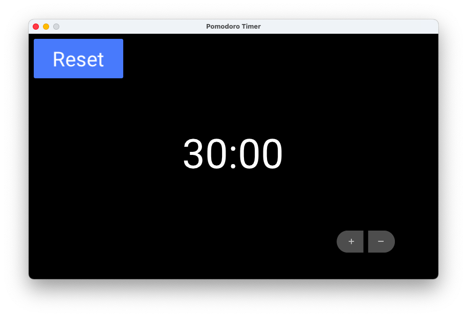

# Pomodoro

A pomodoro timer that is customizeable on the fly.



## Installation

Linux: Ensure that `aplay` is installed
Mac: Nothing (`afplay` is installed by default)

## Running

To run:

``` sh
mix deps.get
mix ecto.create
mix ecto.migrate
iex -S mix
```
